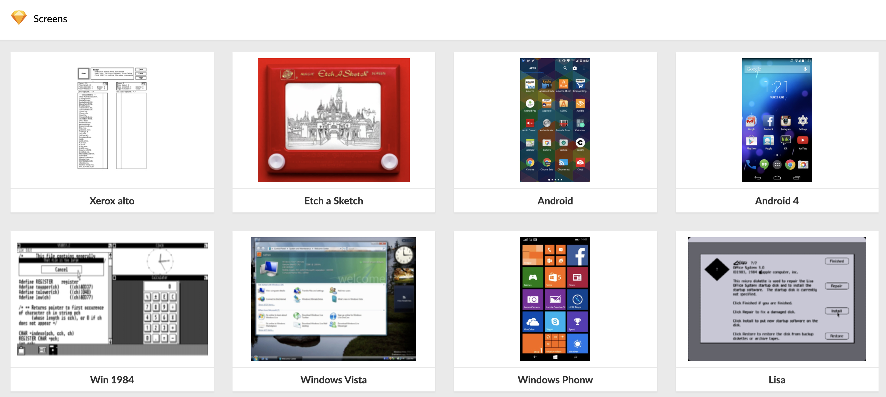

# Sketch Document Viewer 🔎

**Sketch Document Viewer** is a basic tool that lets you preview Sketch documents and included artboards in the cloud.

## Setup

### Prerequisites

* Modern version of Node.js (14+) - can be configured using [nvm](https://github.com/nvm-sh/nvm) and `nvm use`
* yarn OR npm

### Local development

* Install required deps - `yarn install` / `npm install`
* Start the dev server - `yarn start` / `npm run start`

### Build for Production

* Build production bundle - `yarn build` / `npm run build`

## What's inside

### Stack

The app was built using the following tools:

* `React` - core of the UI layer
* `create-react-app` - bootstrap, dev server
* `yarn` - dependency management
* `@reach/router` - simple declarative routing
* `Apollo Client` - communicating with Sketch API (GraphQL)
* `styled-components` - styling
* `Prettier` - code formatting

### Key concepts

* The app consists of three main routes - home (`src/home`), document (`src/document`) and artboard (`src/artboard`)
* Each route represents specific domain of the app that could be developed independently. This is the reason why there's no structure per file type (containers/components/common, etc.) but rather "directory per domain". Also, such a structure helps keeping the project relatively flat.
* Thanks to Apollo Client's in-memory cache there's no need to introduce additional state management solutions. We request the same piece of data for document and artboard views, but the actual XHR call happens only once when navigating from one page to another. Also, there's no global shared state that would require introducing more complex solutions or relying on Context API.
* Labels are kept separately from components. To define more string-based labels that could be translated when needed, extend the `src/i18n/index.js`
* `src/ui` could work as a set of feature-agnostic ui components - due to a low complexity of the app, right now it's just a foundation for possible enhancements in this area.

### Todo

* tests - either unit tests covering individual components, or more general integration tests to cover longer scenarios
* browser compatibility - making sure that fallbacks for features like CSS Grid are introduced and work properly (if needed)

### Hacks

* Calculating `ArtboardPreviewFrame` height in `ArtboardPreview.js` is far from elegant - I had to introduce absolutely-positioned div to introduce full height container, and later on I'm subtracting header's height to calculate artboard viewport. Thanks to component-based architecture, tho, this complexity is local and should be improved over time.

### Tested on

Desktop:

* Chrome 86
* Safari 14
* Firefox 82